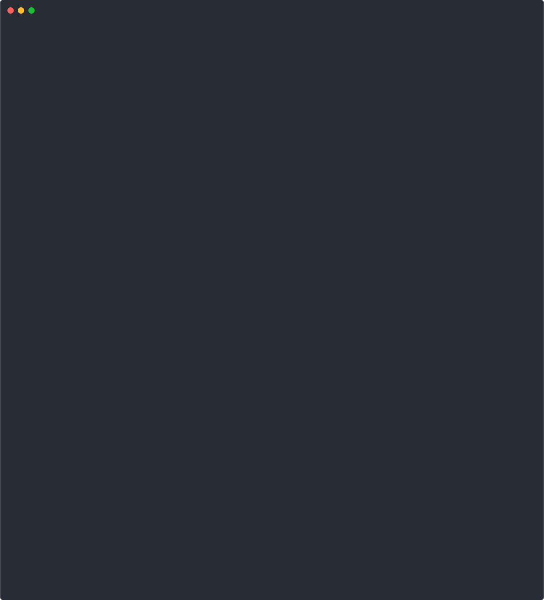

# SCONE Confidential Computing Platform

This repo contains several markdown files that explain how to install the SCONE platform. It also contains a version file:

- [`stable.txt`](stable.txt): the latest stable version of the SCONE platform

The SCONE Confidential Computing Platform consists of components running on your local computer and components running in a Kubernetes cluster. First, install the SCONE software components on your local machine:

- [`prerequisite_check.md`](prerequisite_check.md): explains how to install all required prerequisites for running `scone`-related commands. To speed up the process, you can execute the script `./scripts/prerequisite_check.sh`. In a final step, the script installs the SCONE CLI by executing `./scripts/install_sconecli.sh`.

- [`sconecli.md`](sconecli.md): a description on how to install the `scone` CLI on your host / development VM. To speed up the process, you can execute the script `./scripts/install_sconecli.sh` to install the latest stable version of the SCONE CLI. Note that this script is called by `./scripts/prerequisite_check.sh`, i.e., one only needs this script to upgrade the SCONE CLI.

Second, install the SCONE platform and a first CAS instance on your Kubernetes cluster:

- [`scone_operator.md`](scone_operator.md): a description on how to install or upgrade the SCONE platform in a Kubernetes cluster. To speed up the process, you can execute the script `./scripts/reconcile_scone_operator.sh`.

- [`CAS.md`](CAS.md): a description on how to create a CAS instance. You can execute as a script: `./scripts/install_cas.sh`. The script asks for the name and the namespace of the CAS - unless you defined environment variables `CAS` and/or `CAS_NAMESPACE`.


## Screencast

Installation of a SCONE CAS:



## Tutorials

- [confidential Java App](https://github.com/scontain/java-args-env-file): we show how to run a cloud-native Java service as a confidential, cloud-native Java service on Intel SGX, Intel TDX, or AMD SEV SNP.

- [golang support](https://github.com/scontain/golang): we provide container images with the latest `Go` versions for building native applications. We show how to build a native `Go` application `caddy` into a [`confidential caddy`](https://github.com/scontainug/caddy) applications using [`scone-signer`](https://sconedocs.github.io/CAS_cli/#scone-signer).

## SCONE CLI Docker Image

### Copy and create the registry env

```bash
cp scone-registry.env.template scone-registry.env
```

Provide the correct credentials. To generate an access token, follow these instructions: <https://sconedocs.github.io/registry/#create-an-access-token>

### Build the image

```bash
docker build -t scone:latest .
```

### Run the image

Create a container using the image

```bash
export KUBECONFIG_PATH=<path-to-your-kubeconfig>
docker run -it --rm \
    -v /var/run/docker.sock:/var/run/docker.sock \
    -v $KUBECONFIG_PATH:/kubeconfig \
    -v ./scone-registry.env:/scone-registry.env \
    scone:latest
```

### Pre-built Container Image

We also maintain a pre-built image at <registry.scontain.com/workshop/scone>. You need to 
define file `scone-registry.env` first. In case you are already logged into `registry.scontain.com`,
you can just execute:

```bash
./scripts/extract_scone-registry-env.sh
```

In case you are not yet logged in, you can manually define this file as follows:

```bash
cat > scone-registry.env <<EOF
export SCONE_REGISTRY_ACCESS_TOKEN="<...>see https://sconedocs.github.io/registry/#create-an-access-token>"
export SCONE_REGISTRY_USERNAME="<...>"
EOF
```

Next, run the following command:

```bash
export KUBECONFIG_PATH="${KUBECONFIG_PATH:-$HOME/.kube/config}"
docker run -it --rm \
    -v /var/run/docker.sock:/var/run/docker.sock \
    -v $KUBECONFIG_PATH:/kubeconfig \
    -v ./scone-registry.env:/scone-registry.env \
    registry.scontain.com/workshop/scone
```

## Automatic Script Extraction

All markdown files are associated with a script that executes the individual steps of the script.

- `scripts/extract-all-scripts.sh`: almost all scripts in the directory `scripts` are automatically derived from the markdown files. If one updates the Markdown files, the generated scripts can be updated by executing `scripts/extract-all-scripts.sh`.

- `scripts/extract-bash.sh`: a simple script that extracts all `bash` and `sh` blocks from a given markdown file and stores them in a script file.

## Screencast: Installation of SCONE CLI and SCONE Operator

The following screencast demonstrates the installation of `prerequisite_check.md`, `scone_operator.md`, and `CAS.md` in action:


Generate updated screencasts by executing `make`.

