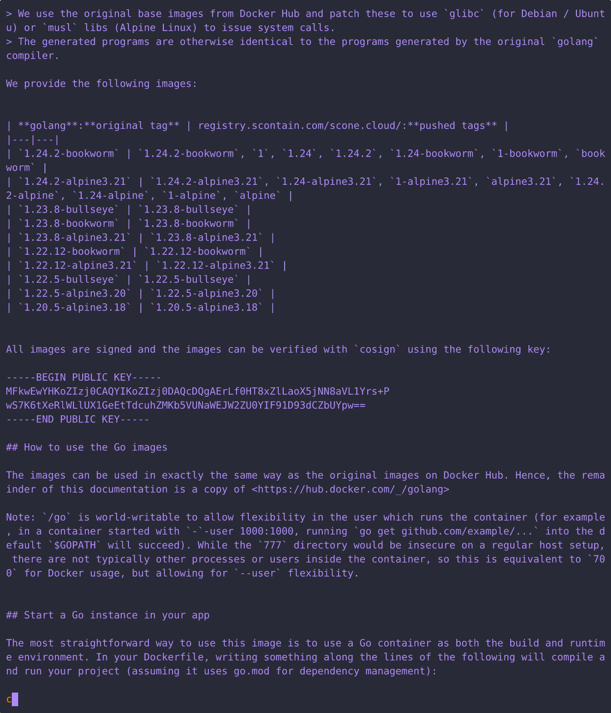

# SCONE Confidential Computing Platform

This repo contains several markdown files that explain how to install the SCONE platform. It also contains a version file:

- [`stable.txt`](stable.txt): the latest stable version of the SCONE platform


## Installation

The SCONE Confidential Computing Platform consists of components running on your local computer (for development) and components running in a Kubernetes cluster (for development and production). We show how to run the development components in a Kubernetes cluster.

### Local Installation

First, if you want to install the development components on your local computer or a development VM, follow these steps.

 > **Note**: Right now, we assume that your computer is an x86 computer. Note that emulation of x86 CPUs is not sufficient - we need some
 > instructions like `rdrnd` that are not emulated. Hence, we show below how to run the development components in a Kubernetes cluster consisting of x86 computers.

- [`prerequisite_check.md`](prerequisite_check.md): explains how to install all required prerequisites for running `scone`-related commands. To speed up the process, you can execute the script `./scripts/prerequisite_check.sh`.


- [`sconecli.md`](sconecli.md): describes how to install the `scone` CLI on your computer or development VM. To speed up the process, you can execute the script `./scripts/install_sconecli.sh` to install either the latest stable version (default) or any other version of the SCONE CLI.


## Installation of Kubernetes Cluster (Development and Production Components)

In case you have no dedicated x86 development VM, you could run the development components as part of a Kubernetes cluster (running x86 computers):

- [`prerequisite_check.md`](prerequisite_check.md): run `./scripts/prerequisite_check.sh` to ensure that you have `kubectl` and `cargo` installed.


Next, install the SCONE platform and a first CAS instance on your Kubernetes cluster. These components are needed to run the confidential application, i.e., the cluster is expected to run Kubernetes nodes that support confidential computing.

> **NOTE:** We can provide you with a plugin for `kubectl` to create a confidential Kubernetes cluster on-premises or on common cloud providers. Just drop us an email at info@scontain.com.

- [`scone_operator.md`](scone_operator.md): describes how to install or upgrade the SCONE platform in a Kubernetes cluster. To speed up the process, you can execute the script `./scripts/reconcile_scone_operator.sh`.


- [`CAS.md`](CAS.md): a description of how to create a CAS instance. You can execute it as a script: `./scripts/install_cas.sh`. The script asks for the name and the namespace of the CAS.


- [`scone_monitoring.md`](scone_monitoring.md): optional installation of Prometheus/Grafana and SCONE dashboards.


- Inside the container, you can build confidential applications like our [confidential Java App](https://github.com/scontain/java-args-env-file). 

- [`k8s.md`](k8s.md) describes the steps to deploy the SCONE commands inside a Kubernetes cluster: these steps are part of script `./scripts/k8s_cli.sh`.


## Tutorials

- [scone-td-build](https://github.com/scontainug/scone-td-build-demos): we show how to transform cloud-native applications into confidential cloud-native applications running on top of Intel TDX, AMD SEV SNP, or Intel TDX.

- [confidential Java App](https://github.com/scontain/java-args-env-file): shows how to run a cloud-native Java service as a confidential, cloud-native Java service on Intel SGX, Intel TDX, or AMD SEV SNP.

- [golang.md](golang.md): SCONE Golang support documentation and workflow.



  - [golang support](https://github.com/scontain/golang): we provide container images with the latest `Go` versions for building native applications. 
  - We show how to build a native `Go` application `caddy` into a [`confidential caddy`](https://github.com/scontainug/caddy) application using [`scone-signer`](https://sconedocs.github.io/CAS_cli/#scone-signer).

## SCONE Workshop Container Image

We maintain a pre-built container image at <registry.scontain.com/workshop/scone> that contains all SCONE development tools. 


### Pull Credentials

Within this container image, we need access to the `registry.scontain.com`: the credentials are stored in file `scone-registry.env`. 

- In case you are already logged into `registry.scontain.com` with your local docker instance, you can just execute:

    ```bash
    ./scripts/extract_scone-registry-env.sh
    ```

    to create file `scone-registry.env`

- In case you are not yet logged in, you can manually define this file as follows:

```bash
tplenv --file scone-registry.env.template --output scone-registry.env --values registy.credentials.yaml --create-values-file --force
```

### Run the Workshop Image

Create a container using the local image:

```bash
export KUBECONFIG_PATH=${KUBECONFIG:-$HOME/.kube/config}
docker run -it --rm \
    -v /var/run/docker.sock:/var/run/docker.sock \
    -v $KUBECONFIG_PATH:/kubeconfig \
    -v ./scone-registry.env:/scone-registry/scone-registry-env \
    registry.scontain.com/workshop/scone
```

> **Note:** `./scripts/k8s_cli.sh` deploys the workshop image within a Kubernetes cluster. Since we need Docker to create container images, we also run a Docker engine in the Kubernetes cluster.

## Background

### Automatic Script Extraction

All markdown files are associated with a script that executes the individual steps of the script.

- `scripts/extract-all-scripts.sh`: most of the scripts in the directory `scripts` are automatically derived from the markdown files. If one updates the Markdown files, the generated scripts can be updated by executing `scripts/extract-all-scripts.sh`.

- `scripts/extract-bash.sh`: a simple script that extracts all `bash` and `sh` blocks from a given markdown file and stores them in a script file.

Generate updated screencasts by executing `make`.

### Building the workshop image

```bash
export HOSTIP=$(ip route show default | awk '/default/ {print $3}')
export HOSTIP="172.17.0.1" # as seen from the docker container
docker context create dind \
  --docker "host=tcp://${HOSTIP}:2375" || true

docker --context dind  buildx build \
    --secret id=kubeconfig,src=$HOME/.kube/config  \
    --secret id=dockerconfig,src=$HOME/.docker/config.json \
    --build-arg DOCKER_HOST="tcp://${HOSTIP}:2375" \
    -t scone:latest \
    --file Dockerfile .
```

Next, you can tag and push your image. For example, we push to:

```bash
docker tag scone:latest registry.scontain.com/workshop/scone
docker push registry.scontain.com/workshop/scone
```
